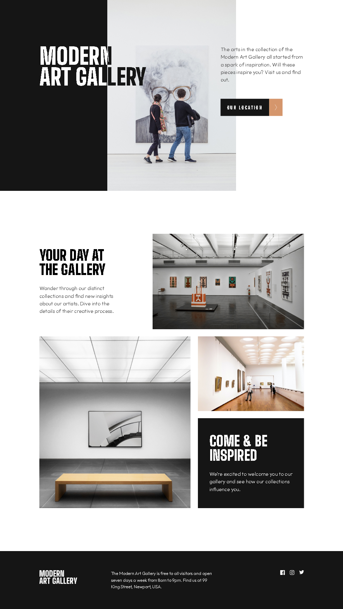

# Frontend Mentor - Art gallery website solution

This is a solution to the [Art gallery website challenge on Frontend Mentor](https://www.frontendmentor.io/challenges/art-gallery-website-yVdrZlxyA). Frontend Mentor challenges help you improve your coding skills by building realistic projects. 

## Table of contents

- [Frontend Mentor - Art gallery website solution](#frontend-mentor---art-gallery-website-solution)
  - [Table of contents](#table-of-contents)
  - [Overview](#overview)
    - [The challenge](#the-challenge)
    - [Screenshot](#screenshot)
    - [Links](#links)
  - [My process](#my-process)
    - [Built with](#built-with)
  - [Author](#author)

## Overview

### The challenge

Users should be able to:

- View the optimal layout for each page depending on their device's screen size
- See hover states for all interactive elements throughout the site
- **Bonus**: Use [Leaflet JS](https://leafletjs.com/) to create an interactive location map with custom location pin

### Screenshot

### Links

- Solution URL: [https://github.com/0x41-li/art-gallery](https://github.com/0x41-li/art-gallery)
- Live Site URL: [Add live site URL here](https://your-live-site-url.com)

## My process

### Built with

- Semantic HTML5 markup
- Flexbox
- CSS Grid
- Mobile-first workflow
- TailwindCSS
- [React](https://reactjs.org/) - JS library
- [Leaflet JS]() - JS library

## Author

- Frontend Mentor - [@0x41-li](https://www.frontendmentor.io/profile/0x41-li)
- Twitter - [@AliSbane2](https://www.twitter.com/AliSbane2)

